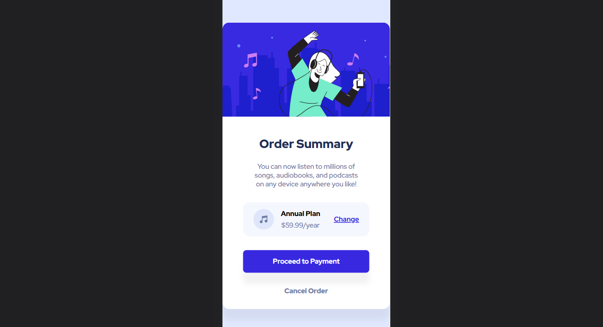

# Frontend Mentor - Order summary card solution

This is a solution to the [Order summary card challenge on Frontend Mentor](https://www.frontendmentor.io/challenges/order-summary-component-QlPmajDUj). Frontend Mentor challenges help you improve your coding skills by building realistic projects. 

## Table of contents

- [Overview](#overview)
  - [The challenge](#the-challenge)
  - [Screenshot](#screenshot)
  - [Links](#links)
- [My process](#my-process)
  - [Built with](#built-with)
  - [What I learned](#what-i-learned)
  - [Continued development](#continued-development)
- [Author](#author)

## Overview

### The challenge

Users should be able to:

- See hover states for interactive elements

### Screenshot

### Links

- Live Site URL: [unavailable](https://your-live-site-url.com)

## My process

### Built with

- Semantic HTML5 markup
- CSS custom properties
- Flexbox
- SCSS
- Mobile-first workflow
- [Next.js](https://nextjs.org/) - React framework

### What I learned

I learned the latest Next.JS 13 to make this component. Kinda hard but I enjoyed it.

### Continued development

I want to make clean code, easy-readable, easy-customize.

## Author

- Github - [fiqihalfito](https://www.github.com/fiqihalfito)
- LinkedIn - [@fiqih-alfito](https://www.linkedin.com/fiqih-alfito)